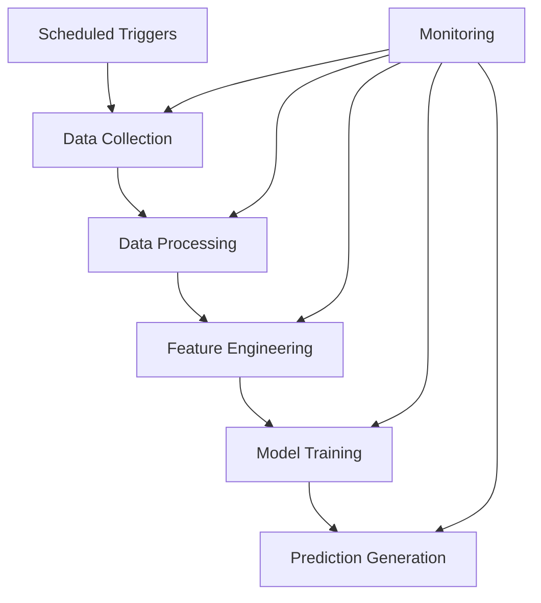

# Airflow Workflow Architecture

## Overview

This document outlines the Apache Airflow architecture for orchestrating data pipelines in the NCAA Basketball Analytics project. Airflow provides a framework for scheduling and monitoring workflows that collect data, transform it, generate features, train models, and deliver predictions.

## Workflow Organization



The project divides workflows into distinct responsibilities:

1. **Data Collection DAGs**: Fetch data from ESPN API and other sources
2. **Data Processing DAGs**: Transform raw data into structured formats
3. **Feature Engineering DAGs**: Calculate derived features for modeling
4. **Model Training DAGs**: Train and evaluate predictive models
5. **Prediction DAGs**: Generate predictions for upcoming games

## DAG Structure

### Organization Pattern

DAGs are organized in the codebase using a modular structure:

```
airflow/dags/
├── constants.py                  # Shared constants
├── utils/                        # Shared utilities
├── data_collection/              # Data collection DAGs
├── data_processing/              # Data processing DAGs
├── feature_engineering/          # Feature engineering DAGs
├── model_training/               # Model training DAGs
└── prediction/                   # Prediction DAGs
```

!!! tip "DAG Isolation"
    Each DAG should be defined in its own Python file with a clear, descriptive name that identifies its purpose.

### DAG Dependencies

DAGs can interact with each other through various mechanisms:

1. **Schedule-based dependencies**: Stagger execution times
2. **ExternalTaskSensor**: Wait for specific task completion
3. **File-based handoffs**: Output files from one DAG serve as input to another

## Design Patterns

### Task Groups

For DAGs with many similar tasks, TaskGroups provide organization and clarity, allowing related tasks to be visually grouped in the Airflow UI and logically organized in the codebase.

### Parameterization

DAGs should be parameterized using configuration rather than hard-coded values. This allows for flexible deployment and easier maintenance.

### Error Handling

Implement appropriate error handling and retries through Airflow's built-in retry mechanisms, including configurable retry counts, delays, and failure notifications.

## Workflow Types

### Data Collection Workflows

Data collection workflows fetch data from external sources and store it in the raw data layer.

Key considerations:
- Rate limiting for API calls
- Error handling and retries
- Incremental vs. full data fetches
- Data versioning and timestamps

### Data Processing Workflows

Data processing workflows transform raw data into a structured format.

Key considerations:
- Data validation
- Schema evolution handling
- Backfilling historical data
- Idempotent operations

### Feature Engineering Workflows

Feature engineering workflows calculate derived features from processed data.

Key considerations:
- Feature dependencies
- Incremental calculation
- Versioning feature definitions
- Performance optimization

### Model Training Workflows

Model training workflows prepare data, train models, and evaluate performance.

Key considerations:
- Train/test splitting
- Hyperparameter management
- Model versioning
- Evaluation metrics tracking

### Prediction Workflows

Prediction workflows generate predictions for upcoming games.

Key considerations:
- Prediction timing (pre-game)
- Model selection
- Confidence intervals
- Prediction storage

## Scheduling Strategies

### Frequency Guidelines

Recommended scheduling frequencies for different workflow types:

| Workflow Type | Frequency | Timing |
|---------------|-----------|--------|
| Data Collection | Daily | Early morning (2-4 AM) |
| Data Processing | Daily | After collection (4-6 AM) |
| Feature Engineering | Daily | After processing (6-8 AM) |
| Model Training | Weekly | Weekends |
| Prediction Generation | Daily | Before games (morning) |

### Dependency Management

Use Airflow's scheduling features to manage dependencies between DAGs:

1. **Schedule Alignment**: Set execution schedule to run after upstream DAGs
2. **External Task Sensors**: Wait for upstream DAGs to complete specific tasks
3. **Triggered DAGs**: Trigger DAGs upon completion of upstream DAGs

## Monitoring and Maintenance

### Logging

All DAGs should implement comprehensive logging (see [Logging Strategy](logging-strategy.md)) to capture information about task execution, timing, and any errors that occur.

### Alerting

Configure alerting for critical workflow failures:

1. Email notifications for failures
2. Integration with team messaging systems
3. Dashboard for workflow status

### Performance Tuning

Guidelines for optimizing Airflow performance:

1. Use appropriate Airflow executor (LocalExecutor for development, CeleryExecutor for production)
2. Implement efficient task sizing (not too small, not too large)
3. Optimize database operations
4. Apply appropriate retry policies

## Implementation Guidelines

When implementing new Airflow workflows:

1. **Start Simple**: Begin with a basic workflow before adding complexity
2. **Test Thoroughly**: Test DAGs with Airflow's testing utilities before deployment
3. **Documentation**: Document purpose, inputs, outputs, and dependencies
4. **Idempotency**: Ensure DAGs can be safely re-run without side effects
5. **Configuration**: Use external configuration rather than hard-coded values

!!! note "Implementation Freedom"
    This document provides architectural guidance for Airflow workflows. Developers have flexibility in implementing specific DAGs as long as they adhere to the overall architecture and patterns.
