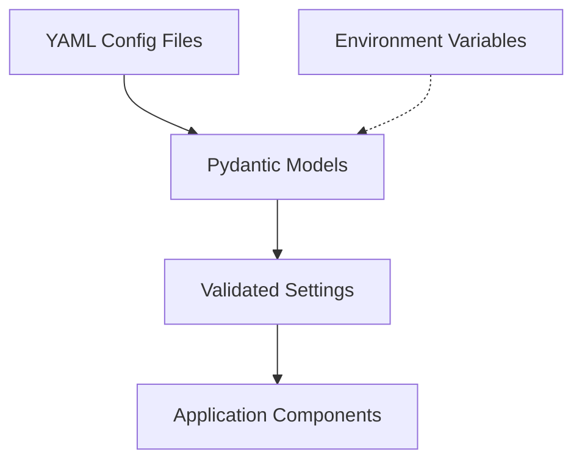

# Configuration Management

## Overview

This document outlines how configuration is managed in the NCAA Basketball Analytics project using YAML files and Pydantic models. This approach provides both flexibility and type safety.

## Configuration Architecture

The project uses a hierarchical configuration system:



Configuration is managed through:

1. **YAML Files**: Static configuration stored in version-controlled files
2. **Pydantic Models**: Type validation and default values
3. **Environment Variables**: Runtime overrides for deployment-specific settings

## Configuration Files

Configuration files are stored in the `config/` directory and organized by component:

| File | Purpose |
|------|---------|
| `api_config.yaml` | ESPN API connection settings |
| `db_config.yaml` | Database configuration |
| `feature_config.yaml` | Feature engineering settings |
| `model_config.yaml` | Model training parameters |

## Example Configuration

### API Configuration

The `config/api_config.yaml` file configures API access:

```yaml
espn_api:
  base_url: "https://sports.core.api.espn.com/v2/sports/basketball/leagues/mens-college-basketball"
  request_timeout: 30
  rate_limit:
    requests_per_minute: 60
    retry_attempts: 3
    backoff_factor: 2.0
  endpoints:
    teams: "/seasons/{year}/teams"
    events: "/seasons/{year}/events"
    athletes: "/seasons/{year}/athletes"
  seasons:
    start_year: 2005
    current_year: 2025
```

### Database Configuration

The `config/db_config.yaml` file configures database settings:

```yaml
duckdb:
  database_path: "data/ncaa_basketball.duckdb"
  storage:
    parquet_directory: "data/processed/"
    use_compression: true
    compression_method: "zstd"
  performance:
    memory_limit: "4GB"
    threads: 4
```

### Feature Configuration

The `config/feature_config.yaml` file configures feature engineering:

```yaml
features:
  storage:
    directory: "data/features/"
    format: "parquet"
  computation:
    window_sizes: [1, 3, 5, 10, 15, 30]
    recalculation_frequency: "daily"
  groups:
    team_stats:
      enabled: true
      lookback_periods: [5, 10, 20]
    player_stats:
      enabled: true
      lookback_periods: [5, 10, 20]
```

## Validation with Pydantic

Configuration values are validated using Pydantic models that define:

1. **Types**: Ensuring values have the correct data type
2. **Defaults**: Providing sensible defaults when values are missing
3. **Constraints**: Enforcing value ranges and relationships
4. **Derived Values**: Calculating values based on other settings

!!! example "Pydantic Model Example"
    ```python
    from pydantic import BaseModel, Field, validator
    from typing import List, Literal
    import os
    
    class FeatureStorageConfig(BaseModel):
        directory: str
        format: Literal["parquet", "csv", "feather"] = "parquet"
        
        @validator('directory')
        def create_directory_if_not_exists(cls, v):
            os.makedirs(v, exist_ok=True)
            return v
    
    class FeatureComputationConfig(BaseModel):
        window_sizes: List[int]
        recalculation_frequency: Literal["hourly", "daily", "weekly"] = "daily"
    
    class FeatureGroup(BaseModel):
        enabled: bool = True
        lookback_periods: List[int] = [5, 10, 20]
    
    class FeatureConfig(BaseModel):
        storage: FeatureStorageConfig
        computation: FeatureComputationConfig
        groups: dict[str, FeatureGroup]
    ```

## Loading Configuration

Configuration is loaded at application startup:

```python
import yaml
from pathlib import Path
from src.config.settings import APIConfig, DBConfig, FeatureConfig, ModelConfig

def load_config(config_dir: str = "config"):
    """Load all configuration files"""
    config_path = Path(config_dir)
    
    # Load API config
    with open(config_path / "api_config.yaml", "r") as f:
        api_config = APIConfig(**yaml.safe_load(f))
    
    # Load DB config
    with open(config_path / "db_config.yaml", "r") as f:
        db_config = DBConfig(**yaml.safe_load(f))
    
    # Load feature config
    with open(config_path / "feature_config.yaml", "r") as f:
        feature_config = FeatureConfig(**yaml.safe_load(f))
    
    # Load model config
    with open(config_path / "model_config.yaml", "r") as f:
        model_config = ModelConfig(**yaml.safe_load(f))
    
    return {
        "api": api_config,
        "db": db_config,
        "features": feature_config,
        "models": model_config
    }
```

## Environment Variable Overrides

The configuration system supports overriding settings through environment variables:

1. **Naming Convention**: `NCAA_SECTION_KEY` (e.g., `NCAA_DB_DATABASE_PATH`)
2. **Precedence**: Environment variables take precedence over file-based configuration
3. **Type Conversion**: Values are converted to the appropriate type based on the Pydantic model

!!! tip "Production Deployments"
    For production deployments, use environment variables to configure:
    
    * API credentials
    * Database connection strings
    * Resource limits (memory, threads)
    * Logging levels

## Best Practices

When working with configuration:

1. **Validate Early**: Validate configuration at application startup
2. **Fail Fast**: Raise clear errors for invalid configuration
3. **Document Options**: Include comments in YAML files explaining options
4. **Default Wisely**: Provide reasonable defaults that work for development
5. **Version Control**: Always commit template configuration files with sensible defaults
6. **Separate Secrets**: Keep sensitive information in environment variables

!!! warning "Sensitive Data"
    Never store API keys, passwords, or other sensitive information in configuration files that are committed to version control.

## Configuration Updates

When updating configuration:

1. Update the YAML file with new options
2. Update the corresponding Pydantic model with new fields
3. Add validators for any constraints
4. Update documentation to reflect new options
5. Provide migration guidance for existing deployments

!!! note "Configuration Freedom"
    This document provides guidelines for the configuration architecture. Developers may extend this system as needed while maintaining the core principles of validation and separation of concerns.
