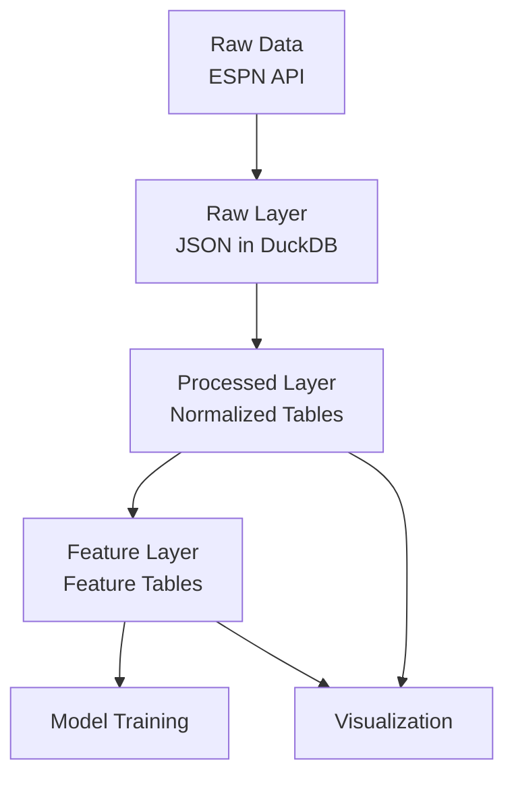
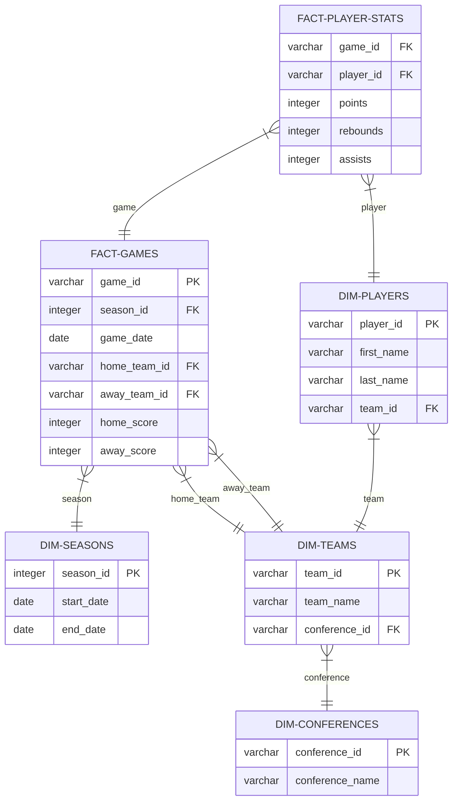

# Data Storage Architecture

## Overview

This document outlines the data storage approach for the NCAA Basketball Analytics project. The system uses a hybrid architecture combining elements of:

1. **Medallion Architecture** (Raw, Processed, Feature layers)
2. **Normalized Relational Model** (for dimension and fact tables)
3. **Feature Store Pattern** (for ML feature management)

## Data Architecture



### Data Layers

The project uses a three-layer data architecture to transform raw data into analysis-ready features:

#### Raw Layer (Raw Data)
- JSON data stored directly from ESPN API in DuckDB tables
- Raw tables follow naming convention `raw_*` (e.g., `raw_teams`, `raw_games`)
- Each raw table includes the JSON payload plus metadata columns
- Purpose: Historical record of source data with lineage tracking

#### Processed Layer (Normalized Data)
- Cleaned, validated, and structured data
- Normalized tables with defined relationships
- Tables follow dimensional modeling conventions (`dim_*` and `fact_*`)
- Purpose: Clean data for analysis and reporting

#### Feature Layer (ML Features)
- Derived features for machine learning
- Denormalized for efficient model training
- Tables follow feature naming convention (`feature_*`)
- Purpose: Ready-to-use features for ML models

## Storage Strategy

The project uses a unified DuckDB-based storage approach:

1. **Single DuckDB Database**: All data layers stored in one `.duckdb` file
2. **JSON Storage**: Raw API responses stored as JSON in DuckDB tables
3. **Polars Integration**: In-memory processing with Polars DataFrames

!!! tip "Storage Benefits"
    This approach provides a unified storage solution with SQL access across all data layers while maintaining the logical separation between raw, processed, and feature data. Using a single database file simplifies data management while still preserving the conceptual medallion architecture.

## Database Schema

### Raw Layer Tables

Raw layer tables store the direct output from API endpoints with minimal transformation:

```
raw_teams:
- id: UUID (primary key, generated)
- team_id: VARCHAR (from API)
- raw_data: JSON (complete API response)
- source_url: VARCHAR (API endpoint)
- collected_at: TIMESTAMP (data collection time)
- processing_version: VARCHAR (API client version)
```

### Processed Layer: Dimensional Model

The processed layer follows a dimensional model with clear relationships between fact and dimension tables:



### Key Dimension Tables

The following dimension tables are fundamental to the data model:

#### Teams

The `dim_teams` table stores information about basketball teams, including team identification, name, conference affiliation, and other team attributes.

#### Players

The `dim_players` table stores information about basketball players, including player identification, name, team affiliation, position, and physical attributes.

#### Seasons

The `dim_seasons` table defines basketball seasons with start and end dates, allowing for time-based analysis across different seasons.

### Key Fact Tables

#### Games

The `fact_games` table stores game results, including references to participating teams, scores, date, and venue information.

#### Player Game Statistics

The `fact_player_game_stats` table stores individual player performance metrics for each game, including points, rebounds, assists, and shooting statistics.

### Feature Layer: Feature Tables

Features are organized into topic-specific tables for model training:

#### Team Features

Time-series features aggregated at the team level, including:
- Offensive efficiency metrics
- Defensive performance indicators
- Performance trends (rolling averages)
- Opponent-adjusted statistics

Tables follow naming pattern: `feature_team_*`

#### Player Features

Features for individual player performance, including:
- Scoring efficiency metrics
- Defensive impact indicators
- Playing time patterns
- Performance consistency metrics

Tables follow naming pattern: `feature_player_*`

#### Game Features

Features related to specific games and matchups, including:
- Team matchup comparisons
- Home/away performance indicators
- Historical matchup statistics
- Game importance metrics

Tables follow naming pattern: `feature_game_*`

## Data Access Patterns

### SQL Queries

DuckDB provides SQL access to all data layers, allowing for queries across raw, processed, and feature layers for different analysis requirements.

### Polars DataFrames

Polars provides efficient in-memory data processing for data transformation and feature engineering tasks, with direct integration with DuckDB for seamless data flow.

## Data Evolution

### Schema Evolution

The project supports schema evolution through:

1. **Version Tracking**: Schema versions are tracked over time
2. **Backward Compatibility**: New fields are added without breaking existing code
3. **Migration Scripts**: Scripts to update historical data when schema changes

### Data Quality

Data quality is maintained through:

1. **Validation Rules**: Constraints and checks for incoming data
2. **Monitoring**: Tracking data quality metrics over time
3. **Error Handling**: Defined processes for handling problematic data

## Implementation Guidelines

When extending the data model:

1. **Maintain the Layer Structure**: Keep the raw/processed/feature separation
2. **Follow Naming Conventions**: Use `raw_*`, `dim_*/fact_*`, and `feature_*` naming schemes
3. **Document Relationships**: Update ERD diagrams when adding tables
4. **Add Data Dictionary Entries**: Document new fields and their meaning
5. **Test Queries**: Ensure new tables work with existing query patterns

!!! note "Implementation Freedom"
    This document provides a framework for data organization. Developers have flexibility in implementing specific tables as needed, as long as they maintain the overall architecture and integration points.
