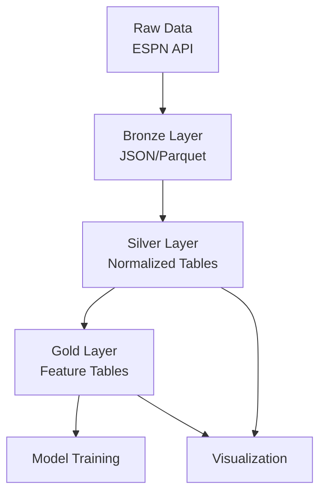
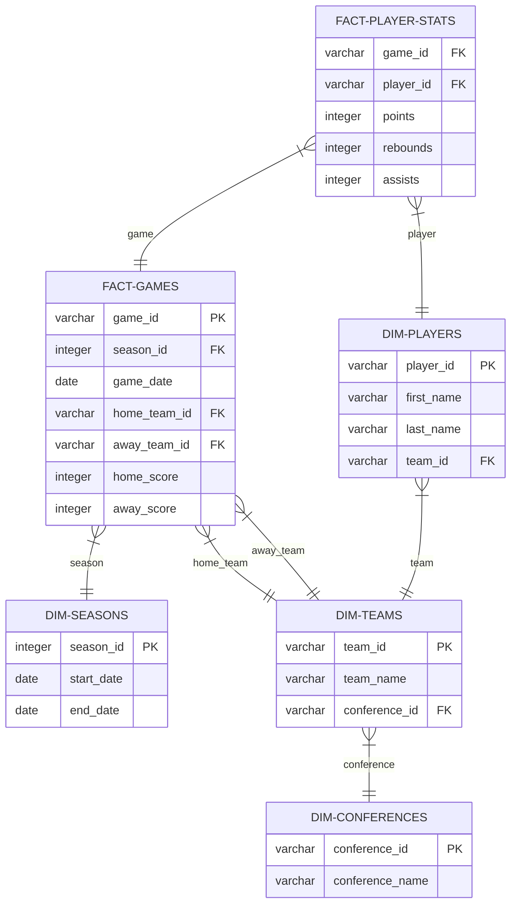

# Data Storage Architecture

## Overview

This document outlines the data storage approach for the NCAA Basketball Analytics project. The system uses a hybrid architecture combining elements of:

1. **Medallion Architecture** (Bronze, Silver, Gold layers)
2. **Normalized Relational Model** (for dimension and fact tables)
3. **Feature Store Pattern** (for ML feature management)

## Data Architecture

### Data Layers

The project uses a three-layer data architecture to transform raw data into analysis-ready features:

#### Bronze Layer (Raw Data)
- JSON data stored directly from ESPN API
- Minimal transformation (except for file format conversion)
- Location: `data/raw/`
- Purpose: Historical record of source data

#### Silver Layer (Processed Data)
- Cleaned, validated, and structured data
- Normalized tables with defined relationships
- Location: `data/processed/`
- Purpose: Clean data for analysis and reporting

#### Gold Layer (Feature Data)
- Derived features for machine learning
- Denormalized for efficient model training
- Location: `data/features/`
- Purpose: Ready-to-use features for ML models

## Storage Strategy

The project uses a combination of:

1. **Parquet Files**: Column-oriented storage for efficient analytics
2. **DuckDB**: SQL interface for querying Parquet files
3. **Polars DataFrames**: In-memory processing

!!! tip "Storage Benefits"
    This approach provides SQL query capabilities without requiring a full database server, making the project portable and lightweight while maintaining analytical performance.

## Database Schema

### Silver Layer: Dimensional Model

The silver layer follows a dimensional model with clear relationships between fact and dimension tables:

### Key Dimension Tables

The following dimension tables are fundamental to the data model:

#### Teams

The `dim_teams` table stores information about basketball teams, including team identification, name, conference affiliation, and other team attributes.

#### Players

The `dim_players` table stores information about basketball players, including player identification, name, team affiliation, position, and physical attributes.

#### Seasons

The `dim_seasons` table defines basketball seasons with start and end dates, allowing for time-based analysis across different seasons.

### Key Fact Tables

#### Games

The `fact_games` table stores game results, including references to participating teams, scores, date, and venue information.

#### Player Game Statistics

The `fact_player_game_stats` table stores individual player performance metrics for each game, including points, rebounds, assists, and shooting statistics.

### Gold Layer: Feature Tables

Features are organized into topic-specific tables for model training:

#### Team Features

Time-series features aggregated at the team level, including:
- Offensive efficiency metrics
- Defensive performance indicators
- Performance trends (rolling averages)
- Opponent-adjusted statistics

#### Player Features

Features for individual player performance, including:
- Scoring efficiency metrics
- Defensive impact indicators
- Playing time patterns
- Performance consistency metrics

#### Game Features

Features related to specific games and matchups, including:
- Team matchup comparisons
- Home/away performance indicators
- Historical matchup statistics
- Game importance metrics

## Data Access Patterns

### SQL Queries

DuckDB provides SQL access to all data layers, allowing for queries across bronze, silver, and gold layers for different analysis requirements.

### Polars DataFrames

Polars provides efficient in-memory data processing for data transformation and feature engineering tasks, with direct integration with DuckDB for seamless data flow.

## Data Evolution

### Schema Evolution

The project supports schema evolution through:

1. **Version Tracking**: Schema versions are tracked over time
2. **Backward Compatibility**: New fields are added without breaking existing code
3. **Migration Scripts**: Scripts to update historical data when schema changes

### Data Quality

Data quality is maintained through:

1. **Validation Rules**: Constraints and checks for incoming data
2. **Monitoring**: Tracking data quality metrics over time
3. **Error Handling**: Defined processes for handling problematic data

## Implementation Guidelines

When extending the data model:

1. **Maintain the Layer Structure**: Keep the bronze/silver/gold separation
2. **Follow Naming Conventions**: Use consistent naming across tables and columns
3. **Document Relationships**: Update ERD diagrams when adding tables
4. **Add Data Dictionary Entries**: Document new fields and their meaning
5. **Test Queries**: Ensure new tables work with existing query patterns

!!! note "Implementation Freedom"
    This document provides a framework for data organization. Developers have flexibility in implementing specific tables as needed, as long as they maintain the overall architecture and integration points.
