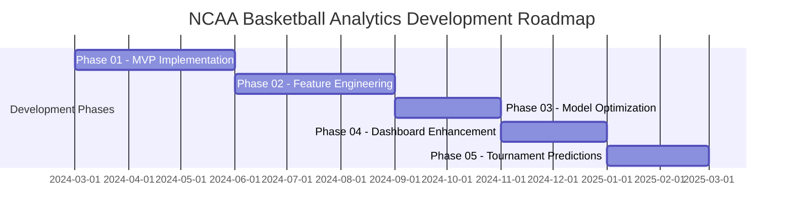

# Development Phases

## Overview

This document outlines the phased development approach for the NCAA Basketball Analytics project. It defines the major milestones for incremental delivery and provides guidance on tracking tasks and progress.



## Development Milestones

### Phase 01: Minimum Viable Product

**Goal**: Establish foundational architecture with basic end-to-end functionality.

**Key Deliverables**:
- Basic ESPN API integration for core data collection
- Initial data processing pipeline with DuckDB storage
- Fundamental feature calculation framework
- Simple predictive models using PyTorch and MLflow
- Basic Plotly Dash visualization dashboard
- Core Airflow workflows for orchestration

**Success Criteria**:
- End-to-end system functioning with basic predictions
- All core architectural components integrated
- Test coverage for critical components

### Phase 02: Comprehensive Feature Engineering

**Goal**: Expand the feature set to capture the complexity of basketball performance.

**Key Deliverables**:
- Extended team performance metrics
- Player-specific features and statistics
- Historical trend features at multiple time scales
- Matchup-specific features comparing team strengths
- Contextual features (home/away, conference games, etc.)
- Feature importance analysis framework

**Success Criteria**:
- Comprehensive feature set documented and implemented
- Feature versioning and dependency management working
- Improved model performance with new features

### Phase 03: Model Optimization

**Goal**: Enhance prediction accuracy through advanced modeling techniques.

**Key Deliverables**:
- Hyperparameter optimization framework
- Ensemble model approaches
- Deep learning architecture improvements
- Model evaluation framework with multiple metrics
- Cross-validation strategies for sports time-series data
- A/B testing infrastructure for model comparison

**Success Criteria**:
- Statistically significant improvement in prediction accuracy
- Robust model validation process
- Model versioning and deployment pipeline

### Phase 04: Visualization Enhancement

**Goal**: Create comprehensive, interactive visualizations for analysis and insights.

**Key Deliverables**:
- Team performance dashboards
- Player analysis visualizations
- Prediction explanation components
- Historical comparison tools
- Interactive model exploration features
- Mobile-responsive dashboard design

**Success Criteria**:
- Intuitive user interface for data exploration
- Effective visualization of prediction insights
- Dashboard performance meets responsiveness targets

### Phase 05: Tournament Predictions

**Goal**: Extend the system to model NCAA tournament performance and bracket predictions.

**Key Deliverables**:
- Tournament-specific features (e.g., seed impacts, bracket position)
- Modeling for single-elimination dynamics
- Bracket simulation engine
- Tournament visualization dashboard
- Historical tournament analysis tools
- Bracket optimization strategies

**Success Criteria**:
- Tournament prediction accuracy above baseline methods
- Complete bracket prediction functionality
- Interactive tournament visualization

## Task Management Approach

### Recommendation

For this project, we recommend a hybrid approach to task management:

1. **GitHub Issues**: Use for tracking active development tasks, bugs, and feature requests
   - Create milestone tags matching the development phases
   - Use labels to categorize tasks by component (API, Models, Features, etc.)
   - Link PRs to issues for traceability

2. **Documentation**: Maintain detailed specifications in the project documentation
   - Use `docs/development/` folder for detailed specifications
   - Organize by phase and component
   - Include requirements, design decisions, and implementation guidance

3. **Task Description Format**: Follow the [Task Writing Guide](../guides/processes/task-writing-guide.md) to create clear, actionable tasks
   - Structured format with explicit requirements
   - Clear acceptance criteria
   - Specific testing instructions
   - References to relevant architecture components

### GitHub Issues Structure

```
- Phase 01: MVP Implementation
  - Issue #1: Set up ESPN API client
  - Issue #2: Implement basic DuckDB schema
  - ...
- Phase 02: Feature Engineering
  - Issue #25: Implement rolling average features
  - ...
```

### Documentation Structure

```
docs/development/
├── phase01-mvp/
│   ├── 01-api-integration.md
│   ├── 02-data-storage.md
│   └── ...
├── phase02-features/
│   ├── 01-team-metrics.md
│   └── ...
└── ...
```

## Progress Tracking

To track progress against these milestones:

1. **Weekly Reviews**: Regular review of open issues and milestone progress
2. **Completion Criteria**: Clear definition of done for each task
3. **Documentation Updates**: Keep documentation in sync with implementation
4. **Milestone Reports**: Generate reports at milestone completion

!!! note "Flexibility"
    This phased approach provides structure but allows for adaptation as requirements evolve and insights emerge during development. Phases may overlap or be adjusted based on progress and priorities.

## Testing Approach

Each development phase includes corresponding test development:

- **Phase 01**: Basic unit tests and integration tests for core functionality
- **Phase 02**: Feature validation tests and data quality checks
- **Phase 03**: Model performance tests and evaluation metrics
- **Phase 04**: UI/UX tests and dashboard functionality testing
- **Phase 05**: Tournament simulation and prediction accuracy testing

## Getting Started

To begin work on a specific phase:

1. Review the phase's key deliverables in this document
2. Check GitHub issues assigned to the relevant milestone
3. Refer to detailed specifications in the `docs/development/` directory
4. Follow the [project workflow](project-structure.md) for development
