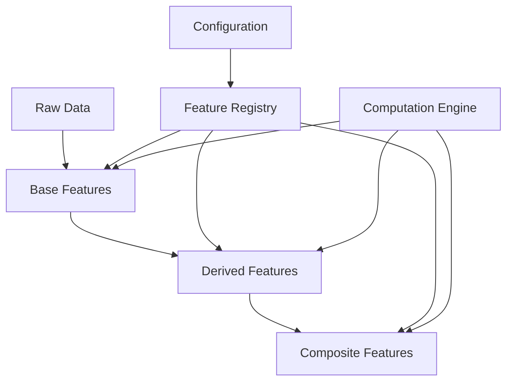

# Feature Engineering Framework

## Overview

This document outlines the feature engineering architecture for the NCAA Basketball Analytics project. The framework provides a structured approach to creating, computing, versioning, and managing features for predictive modeling of basketball games.

## Core Concepts

The feature engineering framework is built around several key concepts:

1. **Feature Hierarchy**: Features organized in a hierarchical structure
2. **Feature Registry**: Central catalog of all available features
3. **Versioning**: Feature definitions versioned for reproducibility
4. **Incremental Computation**: Efficient recalculation of only what's needed
5. **Lineage Tracking**: Clear tracking of feature dependencies and sources



## Feature Types

The framework supports different types of features, each with specific implementation patterns:

### Base Features

Base features are calculated directly from raw data and form the foundation of the feature hierarchy.

**Examples**:
- Game statistics (points, rebounds, assists)
- Team metadata (conference, home/away)
- Game context (date, season, tournament flags)

### Derived Features

Derived features are calculated from base features and provide more complex insights.

**Examples**:
- Rolling averages (last 5 games performance)
- Efficiency metrics (points per possession)
- Relative performance (vs. league average)

### Composite Features

Composite features combine multiple derived features to create high-level insights.

**Examples**:
- Matchup advantages (team A vs team B strengths)
- Contextual performance (home vs away, conference vs non-conference)
- Momentum indicators (recent form considering multiple factors)

## Implementation Architecture

The feature engineering framework consists of several components:

### Base Feature Class

All features extend a base class that provides common functionality:

!!! example "Base Feature Structure"
    ```python
    class BaseFeature:
        """Base class for all features"""
        
        def __init__(
            self,
            name: str,
            version: int = 1,
            description: str = "",
            dependencies: List[str] = None,
            category: str = "uncategorized",
            tags: List[str] = None
        ):
            # Initialize feature metadata
            pass
        
        def compute(self, data, incremental=True, **kwargs):
            """Compute feature values"""
            # Common computation logic
            pass
        
        def validate(self, data):
            """Validate feature values"""
            # Common validation logic
            pass
    ```

### Feature Registry

The registry maintains a catalog of all available features and their metadata:

!!! example "Feature Registry"
    ```python
    class FeatureRegistry:
        """Registry of all available features"""
        
        def __init__(self):
            self.features = {}
            
        def register(self, feature_class):
            """Register a feature class"""
            # Registration logic
            pass
            
        def get_feature(self, name, version=None):
            """Get a feature by name and optional version"""
            # Retrieval logic
            pass
            
        def get_dependencies(self, feature_name, version=None):
            """Get all dependencies for a feature"""
            # Dependency resolution
            pass
    ```

### Computation Engine

The computation engine handles the efficient calculation of features:

1. **Dependency Resolution**: Determines the order of feature computation
2. **Incremental Processing**: Computes only what has changed
3. **Parallel Execution**: Calculates independent features concurrently
4. **Caching**: Stores intermediate results for reuse

## Feature Categories

Features are organized into logical categories:

### Team Features

Features that describe team performance and characteristics.

!!! example "Team Feature Example"
    ```python
    class TeamOffensiveEfficiency(BaseFeature):
        """Team's offensive efficiency (points per possession)"""
        
        def __init__(self, version=1):
            super().__init__(
                name="team_offensive_efficiency",
                version=version,
                description="Points scored per 100 possessions",
                dependencies=["team_points", "team_possessions"],
                category="team_efficiency"
            )
        
        def _compute_impl(self, data, **kwargs):
            # Calculation logic
            return data.with_column(
                (pl.col("team_points") * 100 / pl.col("team_possessions"))
                .alias(self.name)
            )
    ```

### Player Features

Features that describe individual player performance and impact.

### Game Context Features

Features that capture the context of games (home/away, rivalry, rest days, etc.).

### Temporal Features

Features that incorporate time-series aspects (trends, momentum, etc.).

## Configuration

Feature engineering is configured through YAML files that define:

1. **Feature Groups**: Sets of related features
2. **Computation Settings**: Window sizes, aggregation periods
3. **Storage Options**: Format and location for feature data
4. **Validation Rules**: Thresholds and constraints for feature values

!!! example "Feature Configuration"
    ```yaml
    features:
      computation:
        window_sizes: [1, 3, 5, 10]  # Game windows for rolling stats
        recalculation_frequency: "daily"
        
      groups:
        team_stats:
          enabled: true
          lookback_periods: [5, 10, 20]
        player_stats:
          enabled: true
          lookback_periods: [5, 10]
    ```

## Best Practices

When implementing new features:

1. **Domain Knowledge**: Incorporate basketball expertise into feature design
2. **Single Responsibility**: Each feature should capture one concept
3. **Clear Documentation**: Document the meaning and calculation of each feature
4. **Validation**: Include validation logic to ensure feature quality
5. **Test Coverage**: Create unit tests for each feature implementation

## Integration Points

The feature engineering framework integrates with other system components:

- **Data Storage**: Features read from and write to DuckDB
- **Model Training**: Features feed into model training pipelines
- **Airflow**: Orchestrates feature computation workflows
- **Configuration**: Features are configured through validated settings

!!! note "Implementation Freedom"
    This document provides architectural guidance for the feature engineering framework. Developers have flexibility in implementation details as long as they adhere to the overall architecture and integration points.
