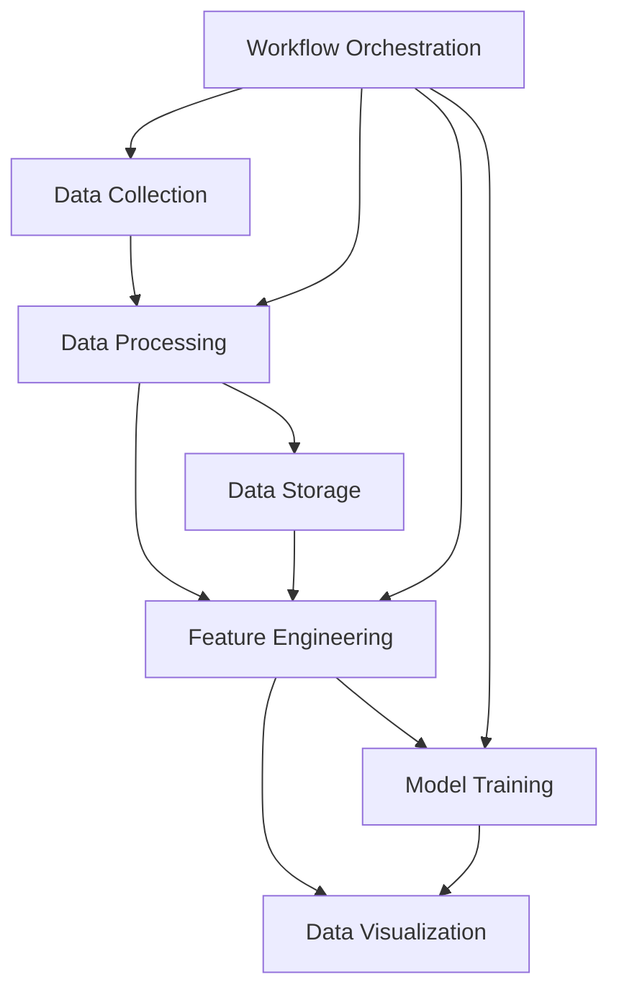

# Architecture Overview

This document provides a high-level overview of the NCAA Basketball Analytics system architecture. It introduces key principles, main components, and documentation organization to help developers understand the system design.

## Key Principles

The system architecture follows these core principles:

- **Modularity**: Separate, loosely coupled components that can be developed and tested independently
- **Scalability**: Ability to handle increasing data volumes and computational demands
- **Reproducibility**: Ensuring consistent results through version control and configuration management
- **Observability**: Comprehensive logging and monitoring to track system behavior

## System Components

The NCAA Basketball Analytics system consists of the following major components:

### Primary Components

1. **Data Collection**: API clients for fetching data from ESPN and other sources
2. **Data Processing**: Transformation pipelines for structuring and validating raw data
3. **Feature Engineering**: Framework for calculating derived features for analysis
4. **Model Training**: Pipelines for training, tuning, and evaluating predictive models
5. **Data Storage**: DuckDB for queryable analytical storage
6. **Workflow Orchestration**: Airflow for scheduling and monitoring data pipelines
7. **Data Visualization**: Dashboard for interactive exploration of data and predictions

## Documentation Structure

Each architectural component has detailed documentation accessible through the navigation menu:

- [Project Structure](project-structure.md): Organization of code, data, and configuration
- [Tech Stack](tech-stack.md): Key technologies and their integration
- [Configuration Management](config-management.md): Managing and validating system configuration
- [Data Table Structures](data-table-structures.md): Database schema and data organization
- [Airflow Workflows](airflow-workflows.md): Workflow definitions and scheduling
- [Feature Engineering](feature-engineering.md): Framework for creating and managing features
- [Logging Strategy](logging-strategy.md): Approach to system logging and monitoring
- [Model Training](model-training.md): Machine learning model development workflow
- [Development Phases](development-phases.md): Phased approach to project implementation and task management

## Getting Started

For new developers, we recommend the following reading order:

1. **[Project Structure](project-structure.md)**: To understand the codebase organization
2. **[Tech Stack](tech-stack.md)**: To familiarize yourself with our technology choices
3. **[Data Table Structures](data-table-structures.md)**: To learn about our data model
4. **[Feature Engineering](feature-engineering.md)**: To understand how we process data for models
5. **[Model Training](model-training.md)**: To learn how prediction models are built
6. **[Development Phases](development-phases.md)**: To understand the project roadmap and how to contribute

!!! tip "Development Guidelines"
    These architecture documents provide guidance rather than strict prescriptions. Developers are encouraged to use their judgment in implementation details while adhering to the overall architecture principles.

## Architecture Evolution

These documents represent the current state of the architecture, which will evolve as the project grows. The architecture is designed to be:

- **Flexible**: Adaptable to changing requirements
- **Incremental**: Allowing gradual implementation of components
- **Testable**: Supporting comprehensive testing at all levels
- **Explainable**: Clear in its design decisions and trade-offs

!!! note "Documentation Updates"
    As the architecture evolves, these documents will be updated to reflect changes. The documentation should be considered a living resource that grows with the project.
