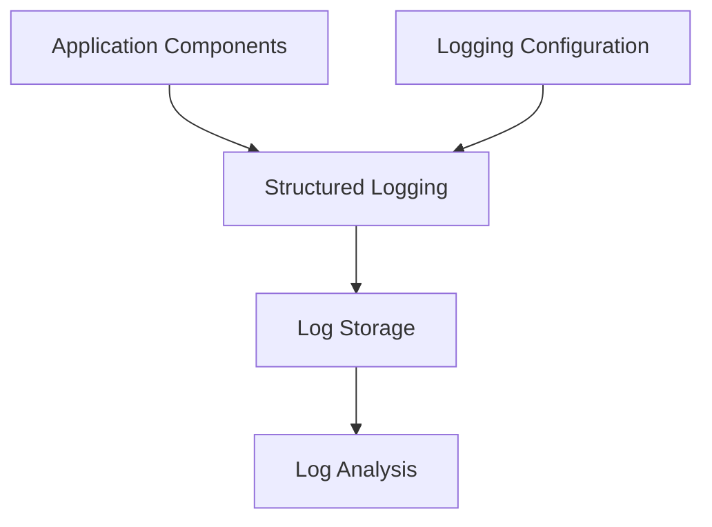

# Logging Architecture

## Overview

This document outlines the logging strategy for the NCAA Basketball Analytics project. A comprehensive logging system is critical for monitoring, debugging, and auditing the data pipelines, feature engineering processes, and model training workflows.

## Logging Principles

The project implements a logging architecture based on these key principles:



1. **Consistency**: Uniform format and level across all components
2. **Granularity**: Appropriate detail for different system parts
3. **Performance**: Minimal impact on execution speed
4. **Traceability**: Request/operation IDs for tracking related logs
5. **Searchability**: Structured logs for easy filtering

## Log Levels

The project uses Python's standard logging levels with specific guidelines:

| Level | Value | Usage |
|-------|-------|-------|
| DEBUG | 10 | Detailed troubleshooting information (data samples, calculations) |
| INFO | 20 | Confirmation of normal operation (pipeline steps, feature calculations) |
| WARNING | 30 | Indication of potential issues (data quality problems, missing values) |
| ERROR | 40 | Error conditions preventing proper function (API failures, calculation errors) |
| CRITICAL | 50 | Critical failures preventing system operation (database failures, data corruption) |

!!! tip "Level Selection"
    Start with INFO level in production for most components. Use DEBUG selectively for troubleshooting, and adjust levels by component based on operational needs.

### Component-Specific Guidelines

| Component | Default Level | Debug Information |
|-----------|---------------|------------------|
| API Client | INFO | Request/response details |
| Data Processing | INFO | Sample transformation results |
| Feature Engineering | INFO | Feature calculation details |
| Model Training | INFO | Training metrics |
| Airflow Tasks | INFO | Task transitions and timing |

## Log Structure

The project uses structured JSON logging with a consistent format:

```json
{
  "timestamp": "2025-03-25T10:23:54.123Z",
  "level": "INFO",
  "logger": "ncaa_basketball.features.team_features",
  "process_id": 12345,
  "thread_id": 123456,
  "trace_id": "abcd1234",
  "operation_id": "feat_calc_team_123",
  "message": "Calculated rolling average points for team: North Carolina",
  "extra": {
    "team_id": "52",
    "window_size": 10,
    "calculation_time_ms": 145,
    "feature_count": 25
  }
}
```

### Standard Fields

- `timestamp`: ISO 8601 format with millisecond precision
- `level`: Log level (DEBUG, INFO, etc.)
- `logger`: Hierarchical logger name
- `process_id`: Operating system process identifier
- `thread_id`: Thread identifier for multi-threaded operations
- `trace_id`: Unique identifier for request flows
- `operation_id`: Identifier for specific operations
- `message`: Human-readable log message
- `extra`: Component-specific structured data

## Log Storage

Logs are organized hierarchically by component:

```
logs/
├── airflow/
│   ├── dags/
│   └── scheduler/
├── api/
├── data/
├── features/
├── models/
└── app.log
```

### Rotation and Retention

The project implements log rotation and retention policies:

- **Rotation**: Daily with timestamp suffix
- **Compression**: Logs older than 1 day are compressed
- **Retention**: 
  - Critical logs: 1 year
  - Error logs: 6 months
  - Warning logs: 3 months
  - Info logs: 1 month
  - Debug logs: 1 week

## Implementation Approach

### Central Configuration

Logging is configured through a central module that provides consistent setup across all components. This module handles configuration of handlers, formatters, and default log levels.

### Contextual Logging

The project adds context to logs through structured fields containing relevant identifiers and metadata for each operation. This contextual information enables tracking of operations across components and simplifies debugging.

### Key Logging Events

Each system component has defined critical events to log:

#### Data Collection

- Start/end of API requests
- Data counts and statistics
- Rate limit information
- Error responses

#### Data Processing

- Start/end of processing jobs
- Record counts (input/output)
- Validation results
- Schema changes

#### Feature Engineering

- Feature calculation starts/completions
- Dependency resolution
- Performance metrics
- Feature statistics

#### Model Training

- Training start/completion
- Hyperparameters
- Iteration metrics
- Evaluation results

#### Predictions

- Prediction generation
- Model version used
- Prediction counts
- Confidence metrics

## Best Practices

When implementing logging:

1. **Be Selective**: Log meaningful events, not every function call
2. **Include Context**: Add relevant identifiers and metadata
3. **Structured Format**: Use structured fields over string formatting
4. **Performance Aware**: Watch for logging overhead in critical paths
5. **Privacy Conscious**: Never log sensitive or personal information

### Performance Considerations

For high-volume components:

- Use asynchronous logging handlers
- Implement sampling for very frequent events
- Buffer logs when appropriate
- Consider logging proxies for high-traffic services

## Log Analysis

The logged data supports various analysis approaches:

1. **Operational Monitoring**: Track system health and performance
2. **Debugging**: Trace errors through the system
3. **Audit Trails**: Review data lineage and changes
4. **Performance Tuning**: Identify bottlenecks and optimization opportunities

!!! note "Implementation Freedom"
    This document provides a logging architecture framework. Developers have flexibility in implementation details as long as they adhere to the overall architecture and formatting standards.
