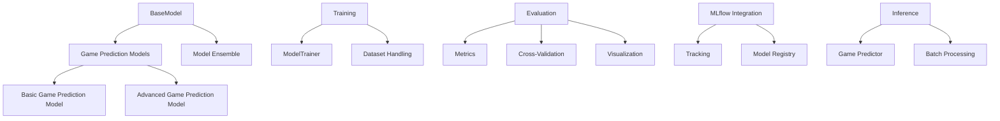
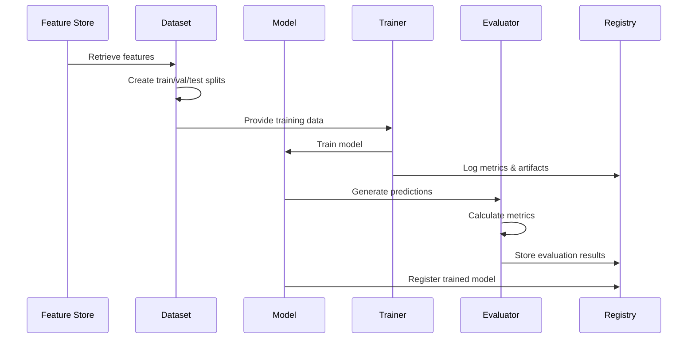

# Model Architecture

## Overview

The NCAA Basketball Analytics modeling framework provides a comprehensive system for training, evaluating, and deploying predictive models for college basketball games. The architecture follows a modular design that supports multiple model types, extensive evaluation metrics, and MLflow integration for experiment tracking.

## Core Components



### Base Framework

The base framework provides the foundational components used by all models:

- **BaseModel**: Abstract base class that defines the common interface for all models
- **ModelConfig**: Configuration class for model parameters and metadata
- **ModelVersion**: Version tracking for models, including creation date and version history

### Model Types

The framework supports various model implementations:

1. **Basic Game Prediction Model**: Simple neural network for game outcome prediction
2. **Model Ensemble**: Combines multiple models for improved prediction accuracy
3. **Custom Model Extensions**: Framework for adding specialized models

## Data Flow



## Training Architecture

The training components manage the process of training models on historical data:

- **ModelTrainer**: Orchestrates the training process including:
  - Batch processing
  - Learning rate management
  - Early stopping
  - Checkpoint saving

- **TrainingMetrics**: Tracks and calculates metrics during training:
  - Loss metrics (MSE, RMSE, MAE)
  - Accuracy metrics (prediction accuracy, point spread accuracy)
  - Learning curves tracking

## Evaluation Framework

The evaluation framework provides comprehensive assessment tools:

- **EvaluationMetrics**: Calculates performance metrics including:
  - Prediction accuracy
  - Point spread accuracy
  - Calibration metrics
  - Feature importance

- **Cross-Validation**: Implements time-series and k-fold cross-validation
  - TimeSeriesSplit
  - KFoldCrossValidator
  - CrossValidationResults

- **Visualization**: Plot generation for model assessment
  - Learning curves
  - Feature importance
  - Calibration curves
  - Confusion matrices

## MLflow Integration

The framework integrates with MLflow for experiment tracking and model management:

- **MLflow Tracking**: Records experiments
  - Hyperparameters
  - Metrics
  - Artifacts
  - Run history

- **MLflow Model Registry**: Manages model versions
  - Model registration
  - Version tracking
  - Staging (development, staging, production)
  - Model lineage

## Inference Pipeline

The inference components manage prediction generation:

- **GamePredictor**: Makes predictions for upcoming games
- **Feature Vector Creation**: Transforms game data into feature vectors
- **Batch Prediction**: Efficiently processes multiple games

## Implementation Details

### Model Implementations

Core model classes implement PyTorch `nn.Module` and the project's `BaseModel` interface:

```python
class BasicGamePredictionModel(BaseModel):
    def __init__(self, config: ModelConfig = None):
        super().__init__(config)
        # Define network architecture

    def forward(self, x):
        # Forward pass implementation

    def predict(self, data):
        # Prediction implementation
```

### Serialization Format

Models are serialized with a standardized format that includes:

- Model weights
- Model configuration
- Version information
- Feature names and preprocessing information
- Metadata including creation date and training metrics

## Configuration

Models are configured through `ModelConfig` objects:

```python
config = ModelConfig(
    name="GamePredictionModel",
    model_type="basic",
    hyperparameters={
        "hidden_size": 64,
        "dropout": 0.3,
        "activation": "relu"
    },
    features=feature_list,
    training_params={
        "learning_rate": 0.001,
        "batch_size": 32,
        "epochs": 100,
        "early_stopping_patience": 10
    }
)
```

## System Requirements

The modeling framework requires:

- PyTorch 2.6.0+
- MLflow 2.10.0+
- scikit-learn 1.5.0+
- Polars 0.20.0+
- DuckDB 0.10.0+
