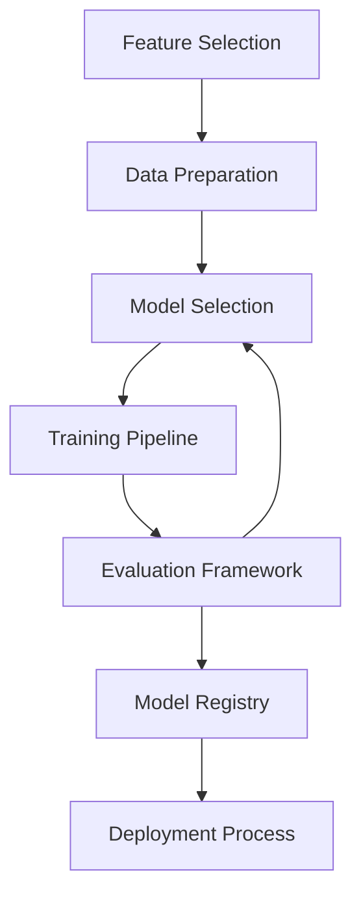

# Model Training Architecture

## Overview

This document outlines the model training architecture for the NCAA Basketball Analytics project. It describes the approach to building, training, evaluating, and deploying predictive models for basketball game outcomes and performance metrics.

## Model Training Framework

The model training pipeline follows a structured workflow:



### Key Components

1. **Feature Selection**: Process of identifying the most relevant features for prediction
2. **Data Preparation**: Creating train/validation/test splits and handling missing values
3. **Model Selection**: Choosing appropriate algorithms for the prediction task
4. **Training Pipeline**: Infrastructure for model training and hyperparameter tuning
5. **Evaluation Framework**: Standard metrics and validation approaches
6. **Model Registry**: Version control for trained models
7. **Deployment Process**: Moving models to production

## Feature Selection

The project uses a systematic approach to feature selection:

1. **Domain Knowledge**: Using basketball expertise to identify potential predictors
2. **Statistical Analysis**: Correlation and information gain measurements
3. **Feature Importance**: From tree-based models like Random Forest and LightGBM
4. **Cross-Validation**: Using k-fold validation to compare feature sets

!!! tip "Feature Documentation"
    Selected features should be documented with justification for inclusion and expected impact on model performance.

## Data Preparation

### Train/Validation/Test Splits

- **Time-Based Splits**: Primary approach for sports prediction models
  - Training: Historical seasons (e.g., 2010-2020)
  - Validation: Recent full season (e.g., 2020-2021)
  - Test: Most recent season (e.g., 2021-2022)

- **Random Splits**: Used for supplementary evaluation
  - Standard 70/15/15 split with stratification
  - Cross-validation with k=5 folds

### Data Preprocessing

Standard preprocessing pipeline:

1. Missing value imputation using statistical approaches
2. Feature scaling where appropriate (standardization or normalization)
3. Encoding categorical features (one-hot, target, or embedding)
4. Feature crossing for key relationships
5. Time-based feature aggregation at different windows

## Model Selection

The project uses multiple model types depending on the prediction task:

### Game Outcome Prediction

- **Primary Model**: LightGBM classifier
  - Efficient training on tabular data
  - Handles categorical features and missing values well
  - Strong performance on sports prediction tasks

- **Alternative Models**:
  - Neural networks for complex pattern recognition
  - Ensemble methods (stacking LightGBM, XGBoost, and CatBoost)

### Score Prediction

- **Primary Model**: LightGBM regressor
- **Alternative Model**: PyTorch MLP regressor

!!! example "Model Configuration"
    ```python
    # Example configuration for a game prediction model
    model_config = {
        'objective': 'binary',
        'metric': 'binary_logloss',
        'boosting_type': 'gbdt',
        'num_leaves': 31,
        'learning_rate': 0.05,
        'feature_fraction': 0.9,
        'bagging_fraction': 0.8,
        'bagging_freq': 5,
        'verbose': -1
    }
    ```

## Training Pipeline

The training pipeline is implemented using MLflow and Airflow:

### MLflow Integration

- **Experiment Tracking**: All training runs recorded with parameters and metrics
- **Model Registry**: Central repository for model versions
- **Artifact Storage**: Saving model files, feature importance, and evaluation results

### Hyperparameter Tuning

- **Bayesian Optimization**: Using libraries like Optuna for efficient hyperparameter search
- **Time-Series Cross-Validation**: To properly evaluate sequential prediction tasks
- **Grid Search**: For smaller parameter spaces

### Hardware Resources

- CPU-based training for tree-based models
- GPU acceleration for neural networks when appropriate

## Evaluation Framework

### Evaluation Metrics

Game outcome prediction metrics:
- Accuracy: Basic correctness measure
- Log Loss: Probabilistic accuracy
- ROC-AUC: Ranking capability
- Precision/Recall: For imbalanced outcomes

Score prediction metrics:
- RMSE: Root Mean Squared Error
- MAE: Mean Absolute Error
- R²: Coefficient of determination

### Evaluation Approaches

- **Backtesting**: Testing on historical data with progressive retraining
- **Out-of-Time Validation**: Evaluating on future data
- **Betting-Based Evaluation**: Converting predictions to betting scenarios
- **Domain-Specific Tests**: Basketball-specific evaluation criteria

## Model Registry

Models are versioned and stored in the MLflow model registry with metadata:

| Metadata | Description |
|----------|-------------|
| Version | Model version and training date |
| Dataset | Training dataset description |
| Performance | Key evaluation metrics |
| Features | Feature list and importance |
| Parameters | Training hyperparameters |
| Notes | Changes from previous versions |

## Deployment Process

The deployment process consists of:

1. **Model Selection**: Choosing the best model from the registry
2. **Staging**: Moving models through dev, staging, and production environments
3. **A/B Testing**: Comparing new models against existing ones
4. **Monitoring**: Tracking model performance in production
5. **Automated Retraining**: Scheduled model updates

!!! warning "Model Drift"
    Models should be regularly monitored for performance degradation over time and retrained when necessary.

## Implementation Guidelines

The model training architecture focuses on principles rather than prescribing specific implementations. Developers should:

- Follow test-driven development for model code
- Document all modeling decisions and assumptions
- Version all data and code used for training
- Perform rigorous backtesting before deployment
- Maintain separation between training and evaluation data
- Compare multiple modeling approaches

!!! note "Implementation Freedom"
    This document provides guidance on the model training architecture. Developers have flexibility in specific implementation details as long as they adhere to the overall architecture and evaluation requirements.

## Implementation Examples

The model training infrastructure is implemented in the following files:

- `src/models/preprocessing.py`: Data preparation utilities
- `src/models/training.py`: Model training functions
- `src/models/evaluation.py`: Evaluation metrics and reporting
- `src/models/prediction.py`: Inference and prediction generation
- `airflow/dags/model_training/`: Airflow DAGs for model training
