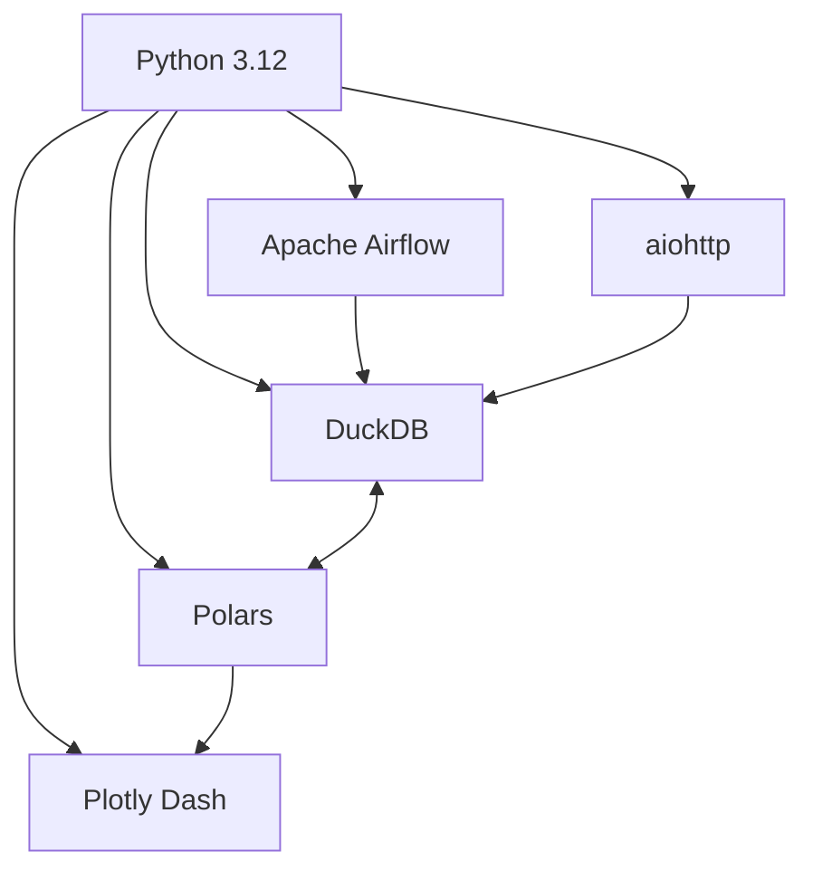

# Tech Stack

## Overview

This document outlines the technology stack for the NCAA Basketball Analytics project, detailing each component's role and integration points. The technologies were selected to create a scalable, maintainable analytics platform optimized for sports data.

## Core Technologies

### Python 3.12

**Role**: Core programming language for all system components.

**Benefits**:
- Latest stable Python version with performance improvements
- Type annotation support for better code quality
- Pattern matching for cleaner data parsing
- Rich ecosystem of data science and machine learning libraries

### Apache Airflow

**Role**: Workflow orchestration platform for scheduling and monitoring data pipelines.

**Key Features**:
- DAGs (Directed Acyclic Graphs) for workflow definition
- Scheduling with cron-like expressions
- Error handling and automatic retries
- Web UI for monitoring and management

**Integration Points**:
- Orchestrates data collection from ESPN API
- Schedules feature computation and model training
- Manages incremental vs. full recalculations

### DuckDB

**Role**: Analytical database for storing, querying, and transforming sports data.

**Key Features**:
- Column-oriented storage optimized for analytics
- SQL interface with advanced analytical functions
- Direct integration with Polars and Pandas
- In-process architecture with minimal setup
- Native JSON support for raw API data storage

**Integration Points**:
- Primary storage for all data layers (raw, processed, and feature)
- Raw API responses stored as JSON in dedicated tables
- Normalized data stored in dimension and fact tables
- Feature data stored in feature-specific tables
- Computation engine for complex queries

### Polars

**Role**: Data manipulation library for efficient transformations and feature engineering.

**Key Features**:
- High-performance operations on large datasets
- Memory efficiency with lazy evaluation
- Native support for parallel execution
- Seamless integration with DuckDB

**Integration Points**:
- Primary data transformation library
- Feature engineering computations
- Preprocessing for ML models

### aiohttp

**Role**: Asynchronous HTTP client for efficient API data collection.

**Key Features**:
- Non-blocking I/O for high-concurrency API requests
- Connection pooling for efficient resource usage
- Configurable timeouts and session management
- Session-based cookie persistence

**Integration Points**:
- Primary library for ESPN API data collection
- Enables concurrent API requests for faster data gathering
- Integrates with rate limiting and backoff strategies

### Plotly Dash

**Role**: Interactive web dashboard for data visualization and exploration.

**Key Features**:
- Interactive charts and graphs
- React-based components with Python backend
- Callback system for dynamic updates
- Layout customization with Bootstrap

**Integration Points**:
- Frontend for data exploration
- Visualization of model predictions
- Interactive team and player analysis

## Supporting Libraries

The following libraries provide additional functionality:

| Library | Purpose | Integration |
|---------|---------|-------------|
| **Pydantic** | Data validation and settings management | Configuration validation |
| **tenacity** | Retry logic with exponential backoff | API request resilience |
| **LightGBM** | Gradient boosting framework | Primary ML algorithm |
| **PyTorch** | Deep learning framework | Alternative ML models |
| **MLflow** | ML experiment tracking | Model versioning and monitoring |
| **Pandas** | Data manipulation (legacy support) | Data integration and export |
| **pytest** | Testing framework | Unit and integration tests |

## Development Tools

The development environment is supported by:

- **UV**: High-performance Python dependency manager and installer for creating/maintaining virtual environments, resolving dependencies, and installing packages
- **pre-commit**: Automated code quality checks
- **MkDocs Material**: Documentation generation
- **GitHub Actions**: CI/CD pipelines

## Technology Selection Criteria

Technologies were selected based on the following criteria:

1. **Performance**: Ability to handle large volumes of sports data efficiently
2. **Maintainability**: Clear APIs and good documentation
3. **Community Support**: Active development and user community
4. **Flexibility**: Adaptable to changing requirements
5. **Simplicity**: Prefer simpler solutions when possible

!!! note "Technology Evolution"
    This tech stack represents the current state of the project. Technologies may be added or replaced as requirements evolve and new tools emerge.
